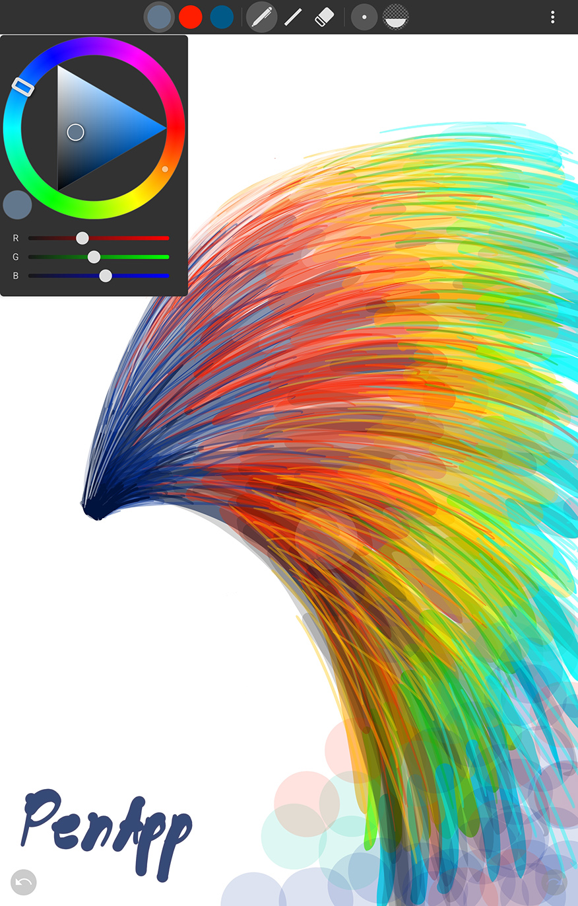
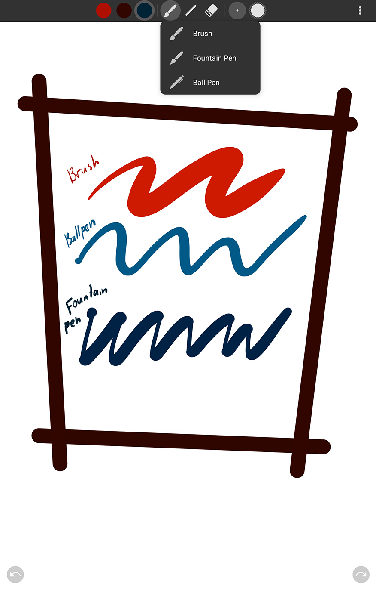
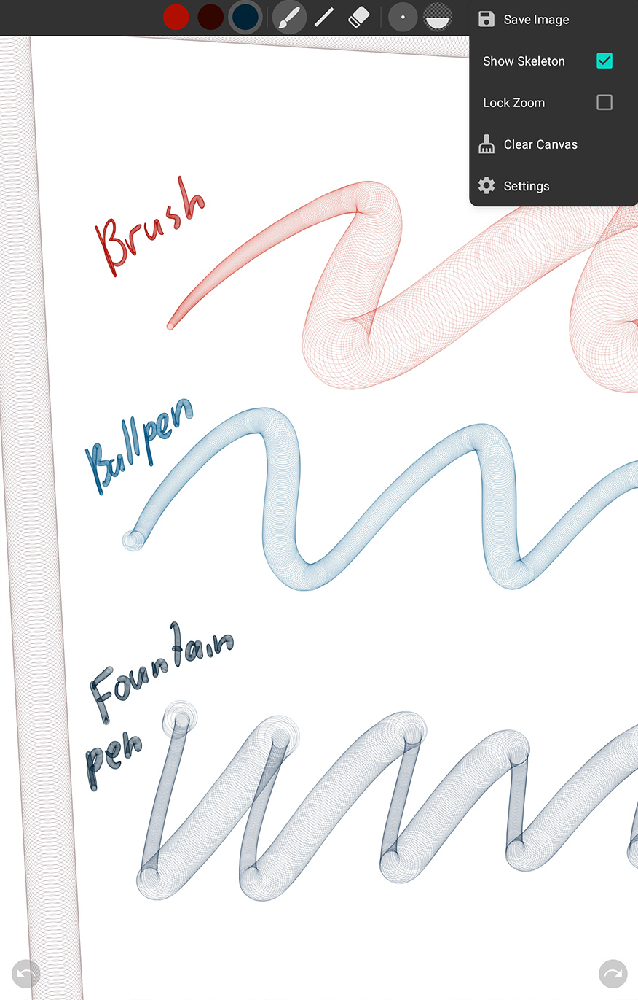

# PenApp
The app was originally created to demonstrate and test PenPath and ColorPickerTriangle libraries, but eventually ended up being a fun little app by itself.

## Features
- Pressure and direction sensitive lines
- Palm rejection
- Pinch to zoom
- Erase by holding stylus button

## ScreenShots

